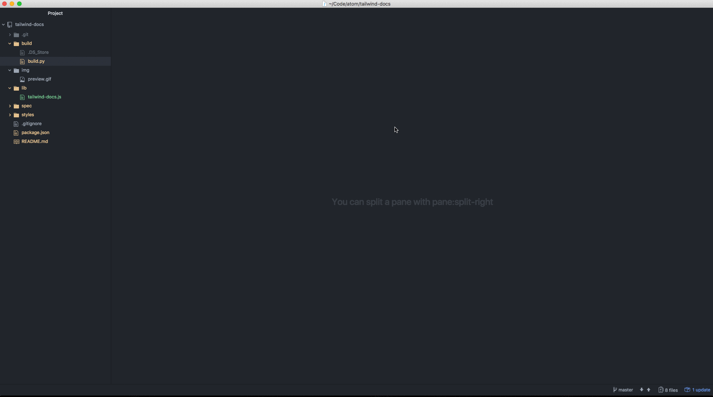

# Atom Tailwind CSS Docs

Easily access Tailwind CSS docs pages from within Atom editor

## Features

To use this extension, simply use `⌘ + Shift + P` to open the command palette (`Ctrl` on windows / linux) and search for "Tailwind Docs" or the specific topic you're after. That's it!

Here's how it works:

## Release Notes

### 1.0.0

Initial release -- Tailwind CSS 0.4.1
